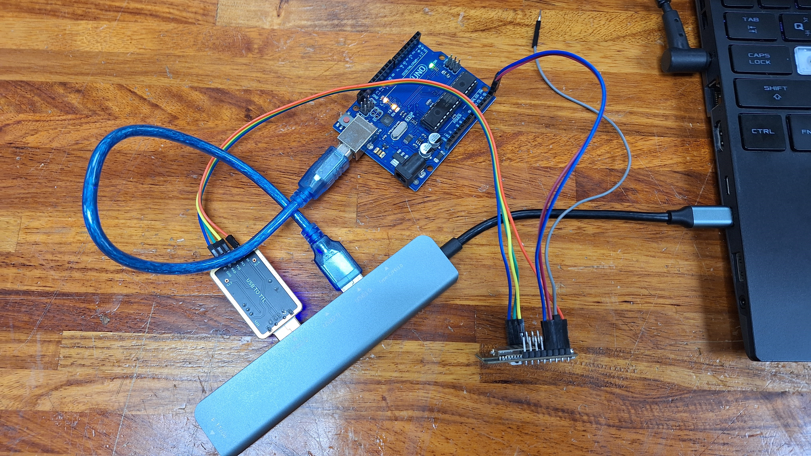

# I2C for ESP32-CAM and Arduino Uno
**If you ever forget how to implement I2C, just come back here for a refresher!**

## File Name: I2C_forESP32cam
**Last Updated**: May 18, 2024

### Project Description
**Objective**: Set up an ESP32-CAM as an I2C master to communicate with an Arduino Uno slave at address 0x39. The process involves the following steps:
1. **ESP32-CAM sends "hello \n 128" to Arduino at address 0x39.**
2. **Arduino Uno receives the command and prints each byte of data, executing a newline upon reaching `\n`.**
3. **ESP32-CAM then requests a 4-byte data sequence from Arduino, where the first two bytes form "hi" and the latter two combine to form the integer 216.**
4. **Upon request, Arduino sends back "h", "i", "216" to the master ESP32-CAM.**

### Wiring Configuration
- **ESP32-CAM to Arduino:**
  - **SDA**: pin 12 -> A4 (SDA)
  - **SCL**: pin 13 -> A5 (SCL)
  - **GND**: pin GND -> GND

### Notes:
1. **This code should be uploaded to the ESP32-CAM and paired with the `I2C_forArduino` file, which should be uploaded to the Arduino.**
2. **A common ground line is not mandatory but is recommended for signal stability.**
3. **Avoid connecting other wires when burning the ESP32-CAM, as this might lead to failure due to voltage division. It's advisable to burn under no-load conditions.**
4. **This code is specifically designed for the ESP32-CAM and should not be used with other ESP32 series devices without checking the ESP32 I2C specifications.**
5. **Based on testing, the ESP32-CAM is only suitable as a master, not as a slave—give up on using it as a slave as it is bug-prone.**
6. **Pay attention to the hexadecimal ASCII code format, like 0xFF, when transmitting signals. Proper handling of integer and character reception is necessary.**
7. **The slave device must have `receiveEvent` and `requestEvent` functions to handle communication; otherwise, the output will be garbled.**

# I2C for ESP32-CAM and Arduino Uno（中文版）
**如果你忘記了如何實施I2C，隨時回來這裡複習！**

## 檔案名稱：I2C_forESP32cam
**最後更新時間**：2024年5月18日

### 項目描述
**目的**：設置ESP32-CAM作為I2C主機與地址0x39的Arduino Uno從機通信。過程包括以下步驟：
1. **ESP32-CAM向地址0x39的Arduino發送"hello \n 128"。**
2. **Arduino Uno接收命令並逐個字節打印數據，遇到`\n`時執行換行。**
3. **ESP32-CAM然後向Arduino Uno請求一組4字節數據，前兩字節組成"hi"，後兩字節組成整數216。**
4. **應請求，Arduino向主機ESP32-CAM發送"h"、"i"、"216"。**

### 接線配置
- **ESP32-CAM至Arduino：**
  - **SDA**：引腳12 -> A4 (SDA)
  - **SCL**：引腳13 -> A5 (SCL)
  - **GND**：引腳GND -> GND

### 備註：
1. **此代碼應上傳至ESP32-CAM，並與應上傳至Arduino的`I2C_forArduino`文件配對。**
2. **共地線不是必需的，但推薦使用以增強信號穩定性。**
3. **燒錄ESP32-CAM的時候，別插著其他線，以防因分壓導致燒錄失敗，建議在無負載狀態下進行燒錄。
4. **此代碼專為ESP32-CAM設計，不適用於其他ESP32系列設備，使用前請查閱ESP32 I2C規範。**
5. **經測試，ESP32-CAM只適合作為主機使用，不適合作為從機，由於存在多個BUG，不建議將其作為從機使用。**
6. **在傳輸信號時，請注意數據格式應為0xFF等十六進位的ASCII碼形式，需要正確處理整數和字符的接收。**
7. **從機端必須實現`receiveEvent`和`requestEvent`函數來處理通信，否則輸出將是亂碼。**

